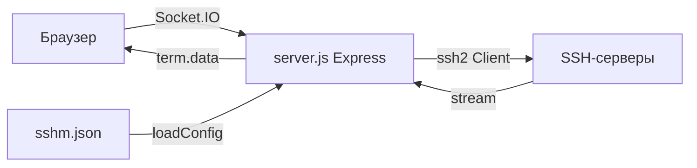

# SSH Multiplexer

Веб-приложение для одновременного управления несколькими SSH-сессиями через браузер. Выбирайте группы серверов и подключайтесь ко всем хостам группы разом — терминалы отображаются в адаптивной сетке на одной странице. Поддерживает широковещательный ввод (одна команда во все терминалы) и индивидуальный ввод в каждый терминал.

## Возможности

- **Групповое подключение** — серверы организованы в группы; при выборе группы открываются терминалы ко всем хостам группы
- **Широковещательная рассылка команд** — ввод в поле "Input" отправляется одновременно на все подключённые терминалы
- **Индивидуальный ввод** — каждый терминал принимает ввод независимо (клик на терминал для фокуса)
- **Reconnect** — переподключение отдельного хоста или всей группы
- **Fullscreen** — каждый терминал можно развернуть на весь экран
- **Адаптивная сетка** — размер минимальной ширины терминала настраивается динамически
- **Уведомления о состоянии** — статус-бар с индикацией подключения/ошибок/переподключения
- **Сборка в бинарник** — через `@yao-pkg/pkg` собираются standalone-исполняемые файлы для Linux и Windows

## Конфигурация (`sshm.json`)

Runtime-конфигурация в формате JSON. Загружается при старте сервера. Полная схема:

```json
{
  "app_port": 3333,                    // опционально, по умолч. 3333
  "app_host": "127.0.0.1",             // опционально, по умолч. 127.0.0.1
  "terminal_defaults": {               // опционально, props для xterm.js
    "fontFamily": "'Fira Code', monospace",
    "fontSize": 11,
    "minWidth": 600
  },
  "groups": [
    {
      "group": "Name",                  // уникальное имя группы
      "hosts": [
        {
          "label": "PC-01",            // отображаемое имя в терминале
          "user": "root",
          "host": "192.168.1.1",
          "port": 22,                  // опционально, по умолч. 22
          "password": "secret"         // plaintext (см. Security)
        }
      ]
    }
  ]
}
```

## Структура проекта

```
ssh-multiplexer/
├── server.js                    # Основной сервер (Express + Socket.IO + SSH2)
├── package.json                 # Зависимости, скрипты, pkg-конфигурация
├── sshm.json                    # Конфигурация приложения (группы хостов, порт, терминал)
├── gendoc.sh                    # Скрипт генерации project_list.md
├── project_list.md              # Автогенерируемая документация кода
├── project_list_v1.md           # Старая версия документации
├── project_lite.md              # Упрощённая версия документации
├── ssh-multiplexer.zip           # Архив (distribution artifact)
├── .gitignore
│
├── public/                      # Frontend (статика)
│   ├── index.html               # Главная страница
│   ├── client.js                # Клиентская логика (Socket.IO, xterm, UI)
│   ├── style.css                # Стили (тёмная тема, сетка, статусы)
│   └── fonts/
│       ├── Inter-Regular.woff2
│       ├── Inter-Italic.woff2
│       ├── Inter-Bold.woff2
│       └── Inter-BoldItalic.woff2
│
└── dist/                        # Собранные бинарники
    ├── ssh-multiplexer-linux     # Linux x64 executable
    ├── ssh-multiplexer-win.exe   # Windows x64 executable
    └── sshm.json                 # Копия конфига для dist
```

## Архитектура



1. **При запуске** `server.js` читает `sshm.json`, запускает HTTP-сервер на `127.0.0.1:3333`
2. **Браузер** подключается через Socket.IO, получает список групп и настройки терминала
3. **При выборе группы** сервер создаёт SSH-подключения (через `ssh2`) ко всем хостам группы, для каждого открывается shell
4. **Данные** SSH-потока пересылаются в браузер через Socket.IO (`term.data`), ввод из браузера — обратно в SSH-поток (`term.input.specific` / `term.input.broadcast.key`)
5. **Широковещательный ввод** — отправляет нажатие на все активные терминалы одновременно

## Запуск

```bash
# Разработка
npm run dev

# Продакшен
npm run server

# Сборка бинарников
npm run build
```

